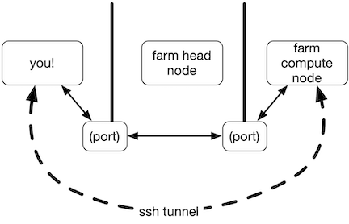
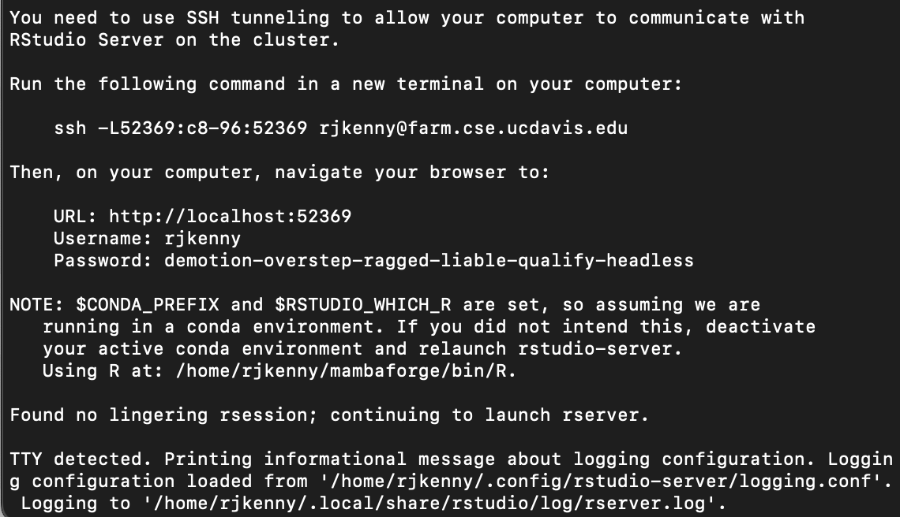
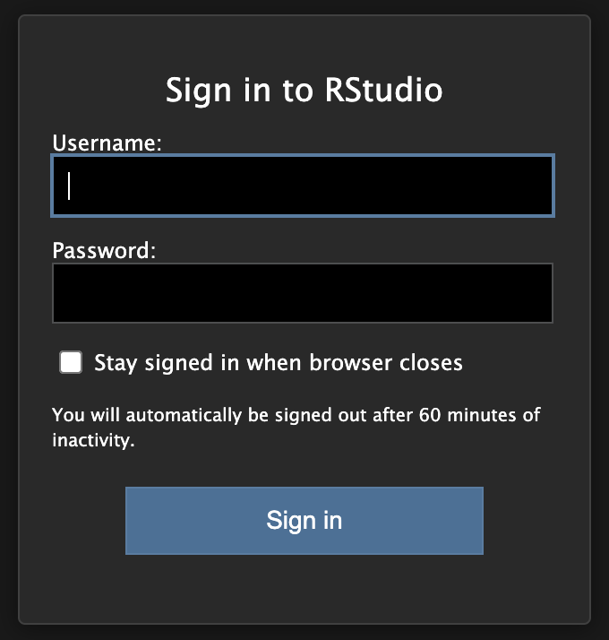

```{r setup, include=FALSE}
knitr::opts_chunk$set(echo = TRUE, eval = FALSE)
```

# RStudio on Farm

Note: This workshop is based on Titus Brown's instructional materials. 

## Overview

Step by step - what is happening here?

* logging in to farm
* srun command
* modules command
* rserver-farm
* logging in again with ssh
* connecting to RStudio Server

## SSH "tunneling" what is happening?



* farm head node doesn’t run big compute jobs, so you can’t run RStudio there
* farm compute nodes are “hidden” from the Internet, so you can’t connect directly to them
* so you tell ssh to “tunnel” from your laptop through farm head node to the farm compute nodes

## Logging in to Farm

### SSH

SSH (Secure Shell) is how we access a remote computer sevurely even over a remote network. 

For mac users this is easily accessed through the terminal. Open a terminal window and type

``` {bash}
ssh USERNAME@farm.cse.ucdavis.edu

```

You may or may not be prompted to enter a password depending on how you configured your ssh settings. 

Windows users can use ssh through MobaXterm following these guidelines: 

https://ngs-docs.github.io/2021-august-remote-computing/connecting-to-remote-computers-with-ssh.html#mac-os-x-using-the-terminal-program

Once you have successfully logged in you should see a prompt similar to this one on your terminal window 

```{bash}

USERNAME@farm:~$

```

## Allocate a computer 

Now we are going to request resources from Farm using some [Slurm](https://slurm.schedmd.com/overview.html) commands. Copy and paste the code below into your terminal. 

```{Slurm}

srun -p high --time=1:00:00 --nodes=1 \
    --cpus-per-task 4 --mem 10GB --pty /bin/bash

```

You should see output like this: 

```{Slurm}

srun: job 61097382 queued and waiting for resources
srun: job 61097382 has been allocated resources

```

but with sighty different numbers for the job ID, and your prompt will change to something like `USERNAME@c8-96`

Here, the `c8-96` is the name of one of the many compute nodes on farm.

The command above asks the farm cluster queuing system to find “room” for you on the cluster to run something for 1 hours on up to 4 CPUs, using 10 GB of RAM.

## Load and run RStudio Server

Now load the Rstudio server module buy running 

``` {Slurm}

module load spack/R/4.1.1

module load rstudio-server/2022.12.0

```

and run the `rserver-lanuch` program

```{Slurm}

rstudio-launch

```

This will print out two things: a complicated looking command starting with `ssh`, and a Web site URL that starts with localhost. You’ll need both of these!

**Example**



## Start ssh tunneling

Now, in a new Terminal window (Mac OS X) or mobaxterm shell window (Windows) **on your laptop**, run the command it printed out for you to run - something like

```{bash}

ssh -L33243:c8-96:33243 rjkenny@farm.cse.ucdavis.edu

```

and then go to the localhost URL (something like `http://localhost:39XXX`) in a browser.

You should end up at an RStudio login page, where you can enter the username and password that were printed out when you ran `rserver-farm`.



### A couple things to get folks going:

You can use the `scp` command in your local computer's terminal window to copy files to the remote system - read more about that [here](https://ngs-docs.github.io/2021-august-remote-computing/connecting-to-remote-computers-with-ssh.html#copying-files-to-and-from-your-local-computer.)

You can also clone a **github repository** using the git clone command in the terminal, or by opening a new R studio project and selecting the version control option. If you want to use the ssh option, you will need to generate a new ssh key on your farm account by running `ssh-keygen`. 

